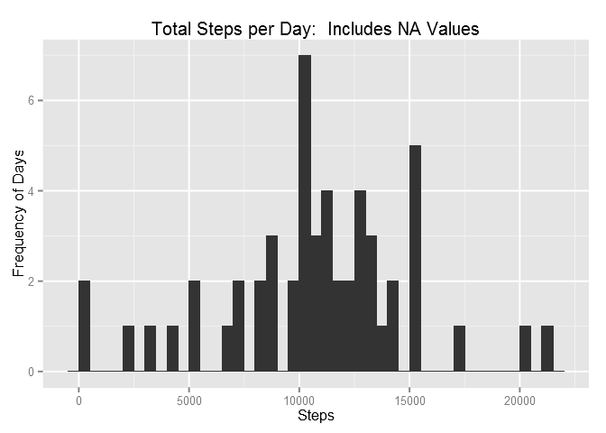
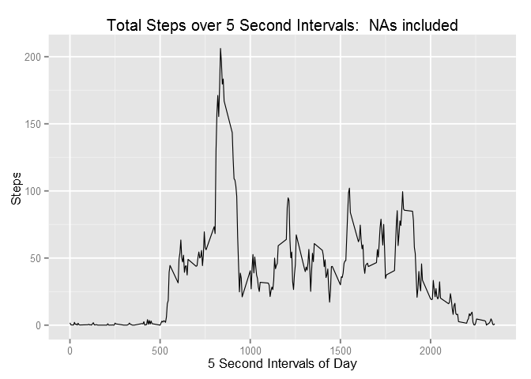
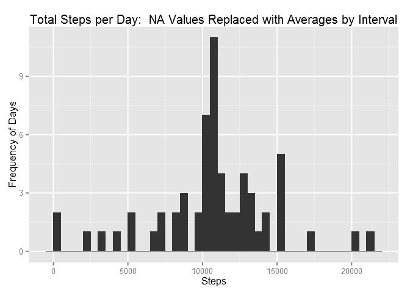
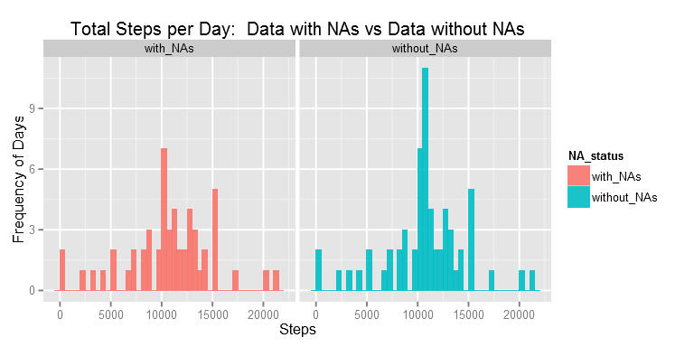
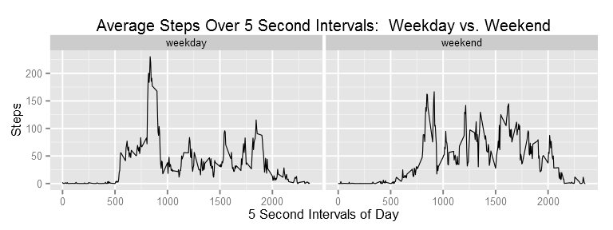

# Reproducible Research: Peer Assessment 1


Author:  Julia Phelps<br>
Date:  12.19.2015<br>
System:
<blockquote>
<font size="2">
<p>Operating system:  Windows 8
<br>Rstudio:  v3.2.2, 64-bit
<br>Package(s) Utilized:  
</p></font></blockquote>

--------------------
<br>

## Introduction
This project is designed to complete the assignment "Peer Assessment 01" for the 
course <u>Reproducible Research</u>, offered through Coursera.

The goal of this project is to produce a data analysis and document it in the 
*Literate Statistical Programming* style, using `R Markdown` and the `knitr` 
package.  An outline of the project is as follows:

* Clone the project from the assignment's Github page;
* Load and preprocess the data set to make it suitable for the analysis;
* Perform a data analysis on a specific, provided set of data;
* Document all code for this analysis in the R Markdown format;
* Integrate specific plots into the document;
* Include thorough text to explain the analysis process;
* And push the entire project to the cloned Github repository for submission.

More details about the specifics of the assignment can be found on the project's 
Github page:
[https://github.com/rdpeng/RepData_PeerAssessment1](https://github.com/rdpeng/RepData_PeerAssessment1)
<br><br>

## About the Data

<blockquote><font size="2">*"It is now possible to collect a large amount of 
data about personal movement using activity monitoring devices such as a Fitbit, 
Nike Fuelband, or Jawbone Up. These type of devices are part of the “quantified 
self” movement – a group of enthusiasts who take measurements about themselves 
regularly to improve their health, to find patterns in their behavior, or 
because they are tech geeks. But these data remain under-utilized both because 
the raw data are hard to obtain and there is a lack of statistical methods and 
software for processing and interpreting the data."*  --reprinted from http://www.coursera.org</font></blockquote>

Activity monitoring devices, such as Fitbits and Jawbone Ups, are used to track 
personal health measurements such as activity levels.  The data used in this 
analysis was collected from a personal activity monitoring device (brand not 
specified), worn by an anonymous individual over the period of October 1st, 2012 
to November 30th, 2012.  The portion of the data set that this analysis focuses 
on represents the steps taken over this two month period, measured in increments 
of every 5 seconds, 24 hours a day.  The data is stored in the assignment's 
Github page (link above), or it can be downloaded directly from the following 
link:

[https://d396qusza40orc.cloudfront.net/repdata%2Fdata%2Factivity.zip](https://d396qusza40orc.cloudfront.net/repdata%2Fdata%2Factivity.zip)
<br><br>

## Design Analysis

This analysis endeavors to explore the given activity monitoring device data and 
identify any potential relationships within the data that could be explored 
further.  This analysis is designed to take the user all the way through the 
process, from initial setup to exploratory data analysis, etc.  As such, the 
entire analysis can be computed by processing this document through `knitr` into 
an HTML file (other formats have not been tested, but they may work too).

Additionally, the analysis process is described in detail in this R Markdown 
file so that the code and thought-process are clear at each step.  The analysis 
begins with basic setup, such as loading packages and data, then progresses into 
some initial exploration/plotting of the data.  Then the analysis makes some 
experimental transformational choices to exclude the `NA` values present in the 
data set, and performs additional plotting/tabling to determine what effect the 
transformational changes have had.  Lastly, the analysis breaks up the data into 
weekday/weekend chunks to study the differences in activity are present in each 
portion of the week.

Note:  This analysis was designed on a Windows 8 64-bit computer using RStudio 
version 3.2.2.  Although the author made every attempt to encode this file in a
universal manner, there is a chance that if you run it in a different environment,
the formatting results of RMarkdown and the appearance of plots contained within 
may differ from this original document.  
<br>

## Required Packages

There are several packages that are required to run this analysis, which we will 
load now:


```r
library(knitr) ## This comes preinstalled on current versions of RStudio.
library(lubridate) ## Used for transforming dates into date-objects.
library(dplyr) ## Used for the bulk of data transformation.
```

```
## 
## Attaching package: 'dplyr'
## 
## The following objects are masked from 'package:lubridate':
## 
##     intersect, setdiff, union
## 
## The following objects are masked from 'package:stats':
## 
##     filter, lag
## 
## The following objects are masked from 'package:base':
## 
##     intersect, setdiff, setequal, union
```

```r
library(ggplot2) ## Used for plotting data.
library(Cairo) ## Used in exporting plots in an attractive manner.
```

**Please Note:  If you do not have these packages already installed on your 
machine, this analysis will not run correctly.  They are all available through 
the CRAN network, and should be installed with the regular `install.packages()` 
function in RStudio/R.**
<br><br>

## First Step - Get the Data

The first thing that you need to do is to create your working directory and
download this file (`PA1_template.Rmd`) and the data that we are using into it.
Though there are undoubtedly several ways to go about this, the most practical 
method is to:

* Fork the assignment repository from Github (link below);
* Set your working directory in RStudio/R;
* Set up Git in this working directory;
* And clone your forked online repository to your local working directory.

Github assignment repository:
[https://github.com/rdpeng/RepData_PeerAssessment1](https://github.com/rdpeng/RepData_PeerAssessment1)

*For more details on this process, please refer to the Github.com helpdocs.*
<br><br>

## Loading and exploring the data

First, we need to load our data.  The block of code below will look for the data 
and unzip it if necessary, then load it into RStudio:


```r
## check for file and download if needbe (note:  if you are not running on a 
## Windows machine, you will likely need to replace mode="wb" below with 
## method="curl" or another machine-specific argument)
if(!file.exists("activity.zip")){
        download.file("https://d396qusza40orc.cloudfront.net/repdata%2Fdata%2Factivity.zip", 
        destfile = "activity.zip", mode="wb")}
## if data has not been unzipped, unzip it
if(!file.exists("activity.csv")){
        unzip("activity.zip", exdir = ".")}
## read in the file
dataTemp <- read.csv("activity.csv", colClasses = c("numeric", "factor", "numeric"))
```

Let's take a look at our data:


```r
dim(dataTemp)
```

```
## [1] 17568     3
```

From this, we can see that our data set has 3 variables and 17568 recorded 
observations. Let's take a quick peek at the data:


```r
head(dataTemp)
```

```
##   steps       date interval
## 1    NA 2012-10-01        0
## 2    NA 2012-10-01        5
## 3    NA 2012-10-01       10
## 4    NA 2012-10-01       15
## 5    NA 2012-10-01       20
## 6    NA 2012-10-01       25
```


```r
tail(dataTemp)
```

```
##       steps       date interval
## 17563    NA 2012-11-30     2330
## 17564    NA 2012-11-30     2335
## 17565    NA 2012-11-30     2340
## 17566    NA 2012-11-30     2345
## 17567    NA 2012-11-30     2350
## 17568    NA 2012-11-30     2355
```

From the description of the data set, we also know that each day is broken up 
into 5-second intervals of recorded activity, which are the same across all 61 
days that were observed.  It might be helpful to know exactly how many intervals 
there are in each day, so let's check:


```r
totalIntervals <- length(unique(dataTemp$interval))
totalIntervals
```

```
## [1] 288
```

There are 288 unique intervals in our data set.  Given that 288 
intervals x 61 days = 17568 observations, we will go ahead and assume that our 
data set is complete.
<br><br>

## Preprocessing the data

The data is relatively clean already and requires little processing, but there 
are a few things that we need to be aware of:

First, there is a lot of missing data in the "steps" variable, which are coded 
as `NA` values.  Let's get an idea of how many values are missing:


```r
table(is.na(dataTemp$steps))
```

```
## 
## FALSE  TRUE 
## 15264  2304
```

There are 2304 observations where the "steps" variable is coded as `NA`.  While 
there is no indication as to why this data is missing, we can assume that it 
will skew our data.  For now, we will leave the `NA` values in the data set, but we will 
need to come up with a plan for dealing with them as we move through the 
analysis.

Another thing worth mentioning is that the dates are recorded as factors, as 
seen below:


```r
sapply(dataTemp, class)
```

```
##     steps      date  interval 
## "numeric"  "factor" "numeric"
```

For right now, the only cleaning that we will perform on the data is to convert 
the dates to date-class objects, using the `lubridate` and `dplyr` packages. 
This will help us further along in our analysis.


```r
data <- mutate(dataTemp, date=ymd(date)) 
```
<br>

## What is the mean total number of steps taken per day?

Now that we have a clean data set, we can explore it a bit.  First, let's take a 
look at how many steps were recorded each day.


```r
totalSteps <- data %>% group_by(date) %>% summarize(steps=sum(steps)) %>% 
    rename(total_steps=steps) %>% print.data.frame
```

```
##          date total_steps
## 1  2012-10-01          NA
## 2  2012-10-02         126
## 3  2012-10-03       11352
## 4  2012-10-04       12116
## 5  2012-10-05       13294
## 6  2012-10-06       15420
## 7  2012-10-07       11015
## 8  2012-10-08          NA
## 9  2012-10-09       12811
## 10 2012-10-10        9900
## 11 2012-10-11       10304
## 12 2012-10-12       17382
## 13 2012-10-13       12426
## 14 2012-10-14       15098
## 15 2012-10-15       10139
## 16 2012-10-16       15084
## 17 2012-10-17       13452
## 18 2012-10-18       10056
## 19 2012-10-19       11829
## 20 2012-10-20       10395
## 21 2012-10-21        8821
## 22 2012-10-22       13460
## 23 2012-10-23        8918
## 24 2012-10-24        8355
## 25 2012-10-25        2492
## 26 2012-10-26        6778
## 27 2012-10-27       10119
## 28 2012-10-28       11458
## 29 2012-10-29        5018
## 30 2012-10-30        9819
## 31 2012-10-31       15414
## 32 2012-11-01          NA
## 33 2012-11-02       10600
## 34 2012-11-03       10571
## 35 2012-11-04          NA
## 36 2012-11-05       10439
## 37 2012-11-06        8334
## 38 2012-11-07       12883
## 39 2012-11-08        3219
## 40 2012-11-09          NA
## 41 2012-11-10          NA
## 42 2012-11-11       12608
## 43 2012-11-12       10765
## 44 2012-11-13        7336
## 45 2012-11-14          NA
## 46 2012-11-15          41
## 47 2012-11-16        5441
## 48 2012-11-17       14339
## 49 2012-11-18       15110
## 50 2012-11-19        8841
## 51 2012-11-20        4472
## 52 2012-11-21       12787
## 53 2012-11-22       20427
## 54 2012-11-23       21194
## 55 2012-11-24       14478
## 56 2012-11-25       11834
## 57 2012-11-26       11162
## 58 2012-11-27       13646
## 59 2012-11-28       10183
## 60 2012-11-29        7047
## 61 2012-11-30          NA
```

As mentioned before, there are a number of days with `NA` values in this data 
set.  We will address the implications of those values later on in the analysis, 
but for now, let's explore the data as-is a little more.

A histogram of the total steps per day in our data set, using the `ggplot2` 
package:


```r
ggplot(totalSteps, aes(total_steps)) +
    geom_histogram(binwidth=500) +
    ggtitle("Total Steps per Day:  Includes NA Values") +
    labs(x="Steps") +
    labs(y="Frequency of Days")
```

 

There is definitely a wide variation in the amount of steps taken per day.  To 
understand the data better, let's take a look at what the average (mean) steps 
and median steps is for each day within the observation period:


```r
meanSteps <- data %>% group_by(date) %>% summarize(steps=mean(steps)) %>% 
    rename(mean_steps=steps)
medianSteps <- data %>% group_by(date) %>% summarize(steps=median(steps)) %>% 
    rename(median_steps=steps)
meanMedianSteps <- merge(x=meanSteps, y=medianSteps, by="date")
meanMedianSteps
```

```
##          date mean_steps median_steps
## 1  2012-10-01         NA           NA
## 2  2012-10-02  0.4375000            0
## 3  2012-10-03 39.4166667            0
## 4  2012-10-04 42.0694444            0
## 5  2012-10-05 46.1597222            0
## 6  2012-10-06 53.5416667            0
## 7  2012-10-07 38.2465278            0
## 8  2012-10-08         NA           NA
## 9  2012-10-09 44.4826389            0
## 10 2012-10-10 34.3750000            0
## 11 2012-10-11 35.7777778            0
## 12 2012-10-12 60.3541667            0
## 13 2012-10-13 43.1458333            0
## 14 2012-10-14 52.4236111            0
## 15 2012-10-15 35.2048611            0
## 16 2012-10-16 52.3750000            0
## 17 2012-10-17 46.7083333            0
## 18 2012-10-18 34.9166667            0
## 19 2012-10-19 41.0729167            0
## 20 2012-10-20 36.0937500            0
## 21 2012-10-21 30.6284722            0
## 22 2012-10-22 46.7361111            0
## 23 2012-10-23 30.9652778            0
## 24 2012-10-24 29.0104167            0
## 25 2012-10-25  8.6527778            0
## 26 2012-10-26 23.5347222            0
## 27 2012-10-27 35.1354167            0
## 28 2012-10-28 39.7847222            0
## 29 2012-10-29 17.4236111            0
## 30 2012-10-30 34.0937500            0
## 31 2012-10-31 53.5208333            0
## 32 2012-11-01         NA           NA
## 33 2012-11-02 36.8055556            0
## 34 2012-11-03 36.7048611            0
## 35 2012-11-04         NA           NA
## 36 2012-11-05 36.2465278            0
## 37 2012-11-06 28.9375000            0
## 38 2012-11-07 44.7326389            0
## 39 2012-11-08 11.1770833            0
## 40 2012-11-09         NA           NA
## 41 2012-11-10         NA           NA
## 42 2012-11-11 43.7777778            0
## 43 2012-11-12 37.3784722            0
## 44 2012-11-13 25.4722222            0
## 45 2012-11-14         NA           NA
## 46 2012-11-15  0.1423611            0
## 47 2012-11-16 18.8923611            0
## 48 2012-11-17 49.7881944            0
## 49 2012-11-18 52.4652778            0
## 50 2012-11-19 30.6979167            0
## 51 2012-11-20 15.5277778            0
## 52 2012-11-21 44.3993056            0
## 53 2012-11-22 70.9270833            0
## 54 2012-11-23 73.5902778            0
## 55 2012-11-24 50.2708333            0
## 56 2012-11-25 41.0902778            0
## 57 2012-11-26 38.7569444            0
## 58 2012-11-27 47.3819444            0
## 59 2012-11-28 35.3576389            0
## 60 2012-11-29 24.4687500            0
## 61 2012-11-30         NA           NA
```

Interesting.  Most of the days have complete values, but a quick count shows 
that 8 different days contain `NA` values.  Also, while the means of the days 
are mostly within a similar range, all of the median values are "0".  This may 
suggest that the subject was more likely to be inactive during any given day 
than to be moving around, possibly due to things like sleep and work.
<br>

## What is the average daily activity pattern?

Changing gears, let's now take a look at the average steps for each interval 
across all days in the data set.  Due to the fact that we are taking the mean of 
the intervals across all days, we will need to omit the `NA` data in order to get 
the calculations to work.


```r
## Calculate the average for each interval
meanIntervals <- data %>% filter(!is.na(steps)) %>% group_by(interval) %>% summarize(steps=mean(steps))
## Plot the data by interval
ggplot(meanIntervals, aes(interval, steps)) + 
    ##geom_point(alpha=0.3, size=2) +
    geom_line(size=0.3) +
    ggtitle("Total Steps over 5 Second Intervals:  NAs included") +
    labs(x="5 Second Intervals of Day") +
    labs(y="Steps ")
```

 

From the plot, we can see that the maximum average steps-per-interval appears to 
be located at an interval somewhere in the mid-800s.  We can look at the data a 
little more closely to determine the exact interval where the average steps is 
highest:


```r
sortAvgInterval <- arrange(meanIntervals, desc(steps))
bestAvgInterval <- sortAvgInterval[1,1]
head(as.data.frame(sortAvgInterval), 10)
```

```
##    interval    steps
## 1       835 206.1698
## 2       840 195.9245
## 3       850 183.3962
## 4       845 179.5660
## 5       830 177.3019
## 6       820 171.1509
## 7       855 167.0189
## 8       815 157.5283
## 9       825 155.3962
## 10      900 143.4528
```

We sorted the data in descending order by steps, with the maximum steps at the 
top.  As we saw in the above plot, the highest average numbers of steps are all 
situated in the mid-800 interval range, with interval 835 being 
the maximum.
<br>

## Inputting missing values

As mentioned previously, there are a large number of missing step values in this 
dataset, all of which are coded as `NA`.  We already noticed while calculating 
the mean and median of steps for each day that there are 8 individual days where 
`NA` values are present.  Given that they are present in roughly 13.1% of the 
total observed days (8 days / 61 total days ~ 13.1%), there is a definite chance 
that these missing values might skew our data analyses.  Since we cannot obtain 
the missing data (which would be ideal), we will instead need to devise a 
strategy for minimizing their impact on the rest of the data set.

To keep the data relatively uniform, we are choosing to replace `NA` step values 
with the average of steps for each interval, which we calculated in the last 
section.  Obviously, this won't be an accurate analysis, since it will 
potentially be adding much higher values than the data would have on its own 
(considering that many days have significant periods of inactivity/low activity), 
but it should at least give us an idea of whether or not the data will change 
very much if the missing values are filled in.

First, let's calculate how many rows have missing values:


```r
missingValues <- filter(data, is.na(steps))
nrow(missingValues)
```

```
## [1] 2304
```

There are 2304 rows with missing values.  Next, let's find out which dates they 
encompass:


```r
unique(missingValues$date)
```

```
## [1] "2012-10-01 UTC" "2012-10-08 UTC" "2012-11-01 UTC" "2012-11-04 UTC"
## [5] "2012-11-09 UTC" "2012-11-10 UTC" "2012-11-14 UTC" "2012-11-30 UTC"
```

As we surmissed earlier, there are 8 individual days where no steps data was 
recorded, and was instead coded as `NA`.

Since all of the data is ordered by interval, we can simply replace the `NA` 
step values in `missingValues` with the average step values that we calculated 
earlier, repeated 8 times:


```r
steps_new <- rep(as.numeric(meanIntervals$steps), times=8)
missingValues <- cbind(missingValues, steps_new)
missingValues <- missingValues %>% select(steps_new, date, interval) %>% 
    rename(steps=steps_new)
```

Then, all we have to do is to is to bind this new data with the non-`NA` data 
from the original set:


```r
## Sort out non-NA data
goodData <- filter(data, !is.na(steps))
## Bind the two sets together
completeData <- rbind(goodData, missingValues)
## And resort the data by date, then interval
completeData <- arrange(completeData, date, interval)
```

Let's look again at the data for average steps by interval:


```r
head(meanIntervals)
```

```
## Source: local data frame [6 x 2]
## 
##   interval     steps
##      (dbl)     (dbl)
## 1        0 1.7169811
## 2        5 0.3396226
## 3       10 0.1320755
## 4       15 0.1509434
## 5       20 0.0754717
## 6       25 2.0943396
```

And compare it to our new data set:


```r
head(completeData)
```

```
##       steps       date interval
## 1 1.7169811 2012-10-01        0
## 2 0.3396226 2012-10-01        5
## 3 0.1320755 2012-10-01       10
## 4 0.1509434 2012-10-01       15
## 5 0.0754717 2012-10-01       20
## 6 2.0943396 2012-10-01       25
```

Looks good!  Now, let's see how this data differs from the original set.  To get 
an idea, let's recalculate the total steps per day, which we calculated above:


```r
totalSteps_complete <- completeData %>% group_by(date) %>% summarize(steps=sum(steps)) %>% 
    rename(total_steps=steps)
ggplot(totalSteps_complete, aes(total_steps)) +
    geom_histogram(binwidth=500) +
    ggtitle("Total Steps per Day:  NA Values Replaced with Averages by Interval") +
    labs(x="Steps") +
    labs(y="Frequency of Days")
```

 

Let's compare this new plot with our old one:


```r
## Create indexes for both data sets, indicating whether or not they have NAs
with_NAs <- rep("with_NAs", times=61)
without_NAs <- rep("without_NAs", times=61)
## Bind indexes to corresponding data sets and rename
totalSteps <- cbind(totalSteps, with_NAs)
colnames(totalSteps) <- c("date", "total_steps", "NA_status")
totalSteps_complete <- cbind(totalSteps_complete, without_NAs)
colnames(totalSteps_complete) <- c("date", "total_steps", "NA_status")
## Bind the two data sets together
totalSteps_all <- rbind(totalSteps, totalSteps_complete)
## Plot the data
ggplot(totalSteps_all, aes(total_steps, fill=NA_status)) +
    facet_grid(.~NA_status) +
    geom_histogram(binwidth=500, alpha=0.9) +
    ggtitle("Total Steps per Day:  Data with NAs vs Data without NAs") +
    labs(x="Steps") +
    labs(y="Frequency of Days")
```

 

Again, replacing the NAs with data averages may not be exactly accurate, but it 
does give us a pretty good indication that the totals of the steps would be 
somewhat different, particularly in the middle of the day, if the original data 
was not missing.  

On the other hand, we see less of a change in the mean and median of steps per 
day for our new "complete" data set, as compared to the old one:


```r
meanSteps_complete <- completeData %>% group_by(date) %>% summarize(steps=mean(steps)) %>% 
    rename(mean_steps=steps)
medianSteps_complete <- completeData %>% group_by(date) %>% summarize(steps=median(steps)) %>% 
    rename(median_steps=steps)
meanMedianSteps_complete <- merge(x=meanSteps_complete, y=medianSteps_complete, by="date")
meanMedianSteps_complete
```

```
##          date mean_steps median_steps
## 1  2012-10-01 37.3825996     34.11321
## 2  2012-10-02  0.4375000      0.00000
## 3  2012-10-03 39.4166667      0.00000
## 4  2012-10-04 42.0694444      0.00000
## 5  2012-10-05 46.1597222      0.00000
## 6  2012-10-06 53.5416667      0.00000
## 7  2012-10-07 38.2465278      0.00000
## 8  2012-10-08 37.3825996     34.11321
## 9  2012-10-09 44.4826389      0.00000
## 10 2012-10-10 34.3750000      0.00000
## 11 2012-10-11 35.7777778      0.00000
## 12 2012-10-12 60.3541667      0.00000
## 13 2012-10-13 43.1458333      0.00000
## 14 2012-10-14 52.4236111      0.00000
## 15 2012-10-15 35.2048611      0.00000
## 16 2012-10-16 52.3750000      0.00000
## 17 2012-10-17 46.7083333      0.00000
## 18 2012-10-18 34.9166667      0.00000
## 19 2012-10-19 41.0729167      0.00000
## 20 2012-10-20 36.0937500      0.00000
## 21 2012-10-21 30.6284722      0.00000
## 22 2012-10-22 46.7361111      0.00000
## 23 2012-10-23 30.9652778      0.00000
## 24 2012-10-24 29.0104167      0.00000
## 25 2012-10-25  8.6527778      0.00000
## 26 2012-10-26 23.5347222      0.00000
## 27 2012-10-27 35.1354167      0.00000
## 28 2012-10-28 39.7847222      0.00000
## 29 2012-10-29 17.4236111      0.00000
## 30 2012-10-30 34.0937500      0.00000
## 31 2012-10-31 53.5208333      0.00000
## 32 2012-11-01 37.3825996     34.11321
## 33 2012-11-02 36.8055556      0.00000
## 34 2012-11-03 36.7048611      0.00000
## 35 2012-11-04 37.3825996     34.11321
## 36 2012-11-05 36.2465278      0.00000
## 37 2012-11-06 28.9375000      0.00000
## 38 2012-11-07 44.7326389      0.00000
## 39 2012-11-08 11.1770833      0.00000
## 40 2012-11-09 37.3825996     34.11321
## 41 2012-11-10 37.3825996     34.11321
## 42 2012-11-11 43.7777778      0.00000
## 43 2012-11-12 37.3784722      0.00000
## 44 2012-11-13 25.4722222      0.00000
## 45 2012-11-14 37.3825996     34.11321
## 46 2012-11-15  0.1423611      0.00000
## 47 2012-11-16 18.8923611      0.00000
## 48 2012-11-17 49.7881944      0.00000
## 49 2012-11-18 52.4652778      0.00000
## 50 2012-11-19 30.6979167      0.00000
## 51 2012-11-20 15.5277778      0.00000
## 52 2012-11-21 44.3993056      0.00000
## 53 2012-11-22 70.9270833      0.00000
## 54 2012-11-23 73.5902778      0.00000
## 55 2012-11-24 50.2708333      0.00000
## 56 2012-11-25 41.0902778      0.00000
## 57 2012-11-26 38.7569444      0.00000
## 58 2012-11-27 47.3819444      0.00000
## 59 2012-11-28 35.3576389      0.00000
## 60 2012-11-29 24.4687500      0.00000
## 61 2012-11-30 37.3825996     34.11321
```

Using the `summary()` function to quickly compare the means and medians from the 
old data set (with NA values) to the new data set (without NAs), we can see that 
there is no change in the mean between the two.  This makes sense, of course, 
since we added in data that was an average of the existing data.

We do see a slight change in the median data, but given that the added average 
data does not have numerous zero values like the rest of the data set, the new 
medians can probably be considered erroneous.

Old data set (with NA values):


```r
summary(meanMedianSteps)
```

```
##       date              mean_steps       median_steps
##  Min.   :2012-10-01   Min.   : 0.1424   Min.   :0    
##  1st Qu.:2012-10-16   1st Qu.:30.6979   1st Qu.:0    
##  Median :2012-10-31   Median :37.3785   Median :0    
##  Mean   :2012-10-31   Mean   :37.3826   Mean   :0    
##  3rd Qu.:2012-11-15   3rd Qu.:46.1597   3rd Qu.:0    
##  Max.   :2012-11-30   Max.   :73.5903   Max.   :0    
##                       NA's   :8         NA's   :8
```

New data set (NA values replaced with averages):


```r
summary(meanMedianSteps_complete)
```

```
##       date              mean_steps       median_steps   
##  Min.   :2012-10-01   Min.   : 0.1424   Min.   : 0.000  
##  1st Qu.:2012-10-16   1st Qu.:34.0938   1st Qu.: 0.000  
##  Median :2012-10-31   Median :37.3826   Median : 0.000  
##  Mean   :2012-10-31   Mean   :37.3826   Mean   : 4.474  
##  3rd Qu.:2012-11-15   3rd Qu.:44.4826   3rd Qu.: 0.000  
##  Max.   :2012-11-30   Max.   :73.5903   Max.   :34.113
```

## Are there differences in activity patterns between weekdays and weekends?

The last thing that we might want to explore is the effect that weekdays versus 
weekends have on the collected data.  Many people have different behaviour on 
weekdays (Mondays through Fridays) versus on weekends (Saturdays and Sundays), 
so this may give us a little more information about the subject's activity 
patterns.

For this part of the analysis, we will use the new `completeData` data set 
(which has had its `NA` step values replaced by averages of steps by interval), 
because we don't want to skew the results due to having missing days' worth of 
step data.

First, we need to add a new column indicating whether a date is a weekday or weekend.  
This is where converting the dates to date-class objects, as we did in the 
preprocessing phase, comes in handy:


```r
weekday <- as.character(wday(completeData$date, label=TRUE))
weekday <- gsub(pattern="Mon|Tues|Wed|Thurs|Fri", replacement="weekday", 
                weekday)
weekday <- gsub(pattern="Sat|Sun", replacement="weekend", weekday)
completeData_weekday <- cbind(completeData, weekday)
```

Next, let's plot the results:


```r
averageSteps_weekday <- completeData_weekday %>% group_by(weekday, interval) %>% 
    summarize(steps=mean(steps))
ggplot(averageSteps_weekday, aes(interval, steps)) +
    facet_grid(.~weekday) +
    geom_line(size=0.3) +
    ggtitle("Total Steps Over 5 Second Intervals:  Weekday vs. Weekend") +
    labs(x="5 Second Intervals of Day") +
    labs(y="Steps")
```

 

It is clear that there are differences in activity levels between weekdays and 
weekends, particularly in the mornings and afternoons.


## Conclusions

* Time of day and day of the week both affect the level of activity of the 
subject.

* NAs affected the totals of data and their relationship to one another.  The 
work-around here was only partially effective - a full set of data would be a 
better alternative.

## Citations

This assignment comes from Coursera.org.  Used with permission.
